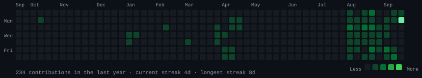

<h3><code>dedwiks@github ~ $ whoami</code></h3>
<table>
<tr>
<td valign="top"></td>
<td valign="top"></td>
</tr>
</table>

  

<h3><code>dedwiks@github ~ $ ./contributions.sh</code></h3>

  

  

<h3><code>dedwiks@github ~ $ ./links.sh</code></h3>

Software Development Engineer &middot; Full-Stack &middot; ML

